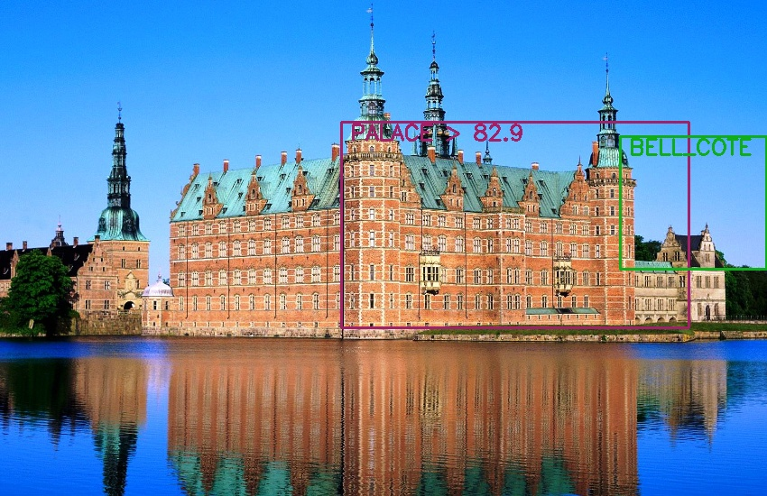
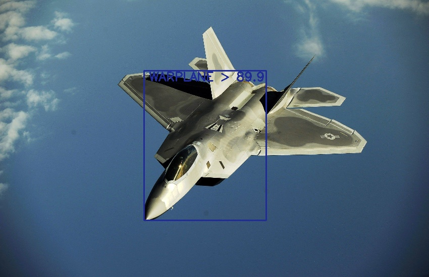

# EOF | Eye-o-Father
Robust Object Detection for Slow Systems!

# Running
`python camera_app.py`

# Explicit Features
- Detection can take place either from Camera or on local Images.
- Model is big, still no worry, you can place object in front of camera or load its Image
  then hit `DETECT` button to begin process.
  
 # Demo results
 
 
 
 

## Don't forget to Star it, if you like my project!
